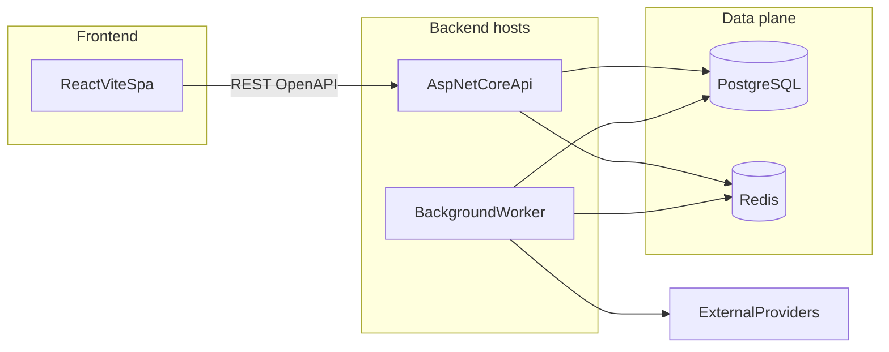
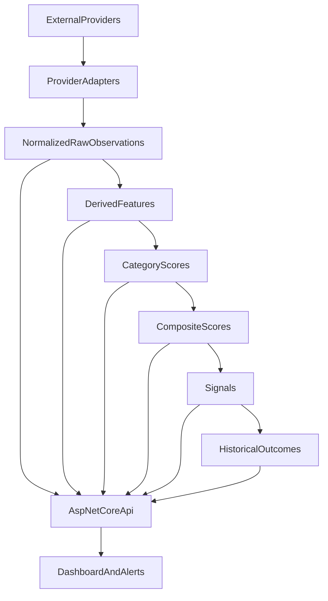

# Architecture

**Status:** Proposed, unless marked otherwise.

High-level system shape for the crypto intelligence platform. Product intent lives in [docs/product/product-spec.md](docs/product/product-spec.md). Domain concepts live in [docs/design/domain-model.md](docs/design/domain-model.md). Pipeline semantics live in [docs/design/data-pipeline.md](docs/design/data-pipeline.md). Scoring rules live in [docs/design/scoring-model.md](docs/design/scoring-model.md).

## Decision summary

| Decision | Status | Choice |
| --- | --- | --- |
| Application kind | Requirement | Analytics and research only; no trading or custody |
| Backend shape | Proposed | ASP.NET Core modular monolith: API host + worker host |
| Frontend shape | Proposed | React + TypeScript SPA on Vite |
| Frontend data/routing | Implemented (M1–M5) | TanStack Router, TanStack Query, Zod, shadcn/ui |
| API contract | Requirement; M4 implemented | REST + OpenAPI; generated frontend client/types/runtime validation |
| Persistence | Proposed | PostgreSQL authoritative; Redis disposable cache/coordination |
| Local runtime | Proposed | Docker Compose on Docker Desktop |
| Realtime transport | Future | Polling first; SSE/WebSockets only if latency needs justify it |
| Distribution | Requirement | No microservices, Kafka, or Kubernetes without a demonstrated need |

## Runtime topology



**Proposed** local Compose services: `frontend`, `api`, `worker`, `postgres`, `redis`. The API and worker may share one image with different entrypoints. Development Compose overrides enable bind mounts and hot reload; production images are multi-stage and run as non-root.

Prefer a same-origin production deployment with `/api` routed to ASP.NET Core and static SPA assets served by a web host/CDN. In local development, use Vite's development proxy for `/api` where practical; if origins differ, configure a narrow development-only CORS policy rather than a permissive production policy.

## Ingestion-to-dashboard flow



Workers own ingestion, feature calculation, scoring, signal detection, and later outcome measurement. The API reads persisted results and does not recalculate scores on each request. See [docs/design/data-pipeline.md](docs/design/data-pipeline.md).

## Modules and dependency direction

**Proposed** bounded modules inside one backend solution:

| Module | Responsibility |
| --- | --- |
| Catalog / universe | Canonical assets, provider symbol maps, Stage A eligibility |
| Ingestion | Provider adapters, scheduling, retry, raw payload isolation |
| Observations | Normalized market, derivatives, on-chain, and related snapshots |
| Features | Deterministic derived feature calculation |
| Scoring | Versioned category and composite scores |
| Signals and outcomes | Signal records and forward-return / MFE / MAE measurement |
| Intelligence events | Catalysts, unlocks, and other dated events |
| Watchlists and alerts | User-facing subscriptions over persisted scores and events |

Dependency rule: adapters and infrastructure depend inward on application and domain contracts. Domain modules must not depend on provider SDKs, HTTP clients, Redis, or UI types. Frontend depends on the API contract only.

The frontend is a client of the API, not a second domain layer. It may reshape view models for charts and tables; it must not invent scores or canonical identities.

## API boundary

**Proposed:**

- Versioned REST API documented with OpenAPI from the ASP.NET Core host.
- Frontend types and HTTP client generated from that contract. Do not hand-write a parallel DTO layer that can drift.
- Untrusted runtime inputs are validated: environment values, router search params, persisted UI state, and API responses where malformed data would affect correctness. Prefer validators generated from the OpenAPI contract when supported; do not manually duplicate every generated DTO as a Zod schema.
- Errors use RFC 9457 problem details.
- First product endpoint family is read-oriented rankings and asset detail. Writes are limited to watchlists/alerts when those features exist.
- Correlation IDs flow from incoming requests through logs and worker-triggered work where a request caused it.

The API is not a pass-through to provider APIs. Callers receive normalized, scored, persisted intelligence.

**Implemented M4:** `GET /api/v1/rankings` reads one stored batch through
Application's `IRankingsReader` and Infrastructure's untracked, read-only
Repeatable Read projection. Selection is greatest as-of for an explicit model
(default `slice1-v1`) or an exact historical UTC hour. It reads no observations,
payloads or replay inputs and invokes no calculator/provider. Partial results
rank alongside complete results; not-ready rows remain present and unranked.
Exact decimal strings, units, knowledge cutoff, model identity and quality fields
are defined in [the M4 contract](docs/engineering/rankings-api.md). The private-use
flag defaults false and local Compose enables it behind loopback/same-origin
boundaries. OpenAPI, errors, cancellation and generated validators are verified.
This path uses no Redis cache and introduces no migration or scoring write.

## Persistence and cache

| Store | Role |
| --- | --- |
| PostgreSQL | Source of truth for assets, observations, features, scores, signals, outcomes, events, and audit/lineage |
| Redis | Cache of hot rankings/detail reads, distributed locks, and short-lived job coordination |

Cache invalidation is a performance concern, not a correctness concern. A cold Redis must not change scores. One backend migration system owns application schemas; do not mix EF migrations, Supabase migrations, and ad-hoc SQL as competing authorities. Do not expose scoring writes through a generic REST data API.

**Unresolved:** hosted PostgreSQL (including Supabase as a managed Postgres option) versus Compose-only Postgres in production. If a hosted Postgres is chosen, Redis and workers still belong to this application. See unresolved decisions below.

## Background processing

**Implemented M2 (2026-09-06):** the worker supports explicit `--migrate` and
bounded `--ingest-once --private-use --country XK` commands. One-shot ingestion
uses the existing Application orchestration and Infrastructure adapters/store;
no new service, endpoint or schema authority is introduced. Normal worker startup
remains an operational heartbeat. The private Compose override adds egress only
for explicit runs; PostgreSQL/Redis stay internal. Both one-shot and hosted paths
honor cancellation and log correlation. See the active plan for the private-use
source review and README for reproducible commands.

**Implemented M3:** `--score-once` and read-only `--replay-scores` add deterministic
Domain calculators and Application read/store ports. Infrastructure captures
canonical observations in read-only Repeatable Read and atomically publishes
immutable model/input/feature/score bundles using PostgreSQL advisory locks.
EF owns the additive migration and immutability triggers. Scoring constructs no
provider clients; Redis is unnecessary for correctness/replay. Exact numerical
rules and lineage are documented beside the [versioned manifest](backend/src/Analysis.Domain/Scoring/Manifests/README.md).
M3 itself added no financial HTTP endpoint; M4's separate read boundary is above.

**Proposed:** a dedicated worker host in the same modular monolith, sharing domain modules with the API.

- Scheduled jobs for cadence classes defined in [docs/design/data-pipeline.md](docs/design/data-pipeline.md).
- Idempotent handlers keyed by asset, observation time, and job type.
- Cancellation tokens on all I/O.
- Failures retry with backoff; poison messages/jobs are recorded, not silently dropped.
- Scoring is a job over persisted features, not an inline request handler.

The MVP runs the worker as a separate process/Compose service from the API while retaining one codebase and one deployable architecture. **Unresolved:** horizontal worker scaling and production placement. Change that topology only if measured operations require it.

## Realtime strategy

**Proposed for MVP:** the dashboard polls rankings and detail via TanStack Query.

**Future:** SSE or WebSockets if score freshness or alert latency cannot be met with polling. Do not add a message bus to push browser updates.

## Observability and operations

**Proposed** defaults, not a vendor selection:

- Structured logs, traces, and metrics with a correlation identifier.
- Health checks for API, worker liveness, PostgreSQL, and Redis.
- Secrets via environment or a secret store; committed samples contain no credentials.
- Deterministic builds and pinned tool versions.

## Frontend integration

**Implemented foundation (2026-09-06):** React + strict TypeScript + Vite SPA,
TanStack Router/Query, Zod 4 and shadcn/ui with the existing new-york/Radix style.
`createApplication` owns one QueryClient and injects it into typed Router context
and `ApplicationRoot`'s provider. Create it once outside React rendering; tests use
isolated factories and memory histories. Router coordinates route loading with
`defaultPreloadStaleTime: 0`; Query owns cache freshness. Construct `new QueryClient()`
with unchanged global Query defaults: no global defaults configuration or setters.
Feature-required per-query options must document their reason in the owning
factory and active plan; test-only policies remain isolated. M5 rankings uses a
single generated-contract read with AbortSignal propagation. Its manual refresh
policy disables only refetchOnMount, refetchOnWindowFocus, refetchOnReconnect and
retry. There is no rankings loader, prefetch or polling. Requested offline work
may resume; reconnect by itself does not refresh a displayed comparison.

**Required frontend ownership:**

```text
frontend/src/
  app/                         application factory, providers, config, layout, devtools
  routes/                      thin file-based Router entries; compose feature components
  features/
    workspace/components/      about view
    rankings/                  selection, transport, query options, presentation
  components/                  reusable DataTable
    ui/                        shared shadcn primitives
  lib/                         shared utilities and Table features/types
```

Features own their components, queries, hooks, schemas and selectors; create
subfolders only when needed. App/routes compose features. Features depend on
shared code, never app assembly/routes or another feature's internals. Shared
components/utilities do not depend on features. Keep `@/lib/utils`, shadcn aliases,
file route URLs and generated route-tree ownership intact. This convention does
not change the backend modular monolith.

Always define Query reads with reusable typed `queryOptions` factories
(`infiniteQueryOptions` for infinite queries). Keep keys and functions together in
the owning feature, reuse options across hooks/loaders and derive cache keys from
them. Query ESLint `flat/recommended-strict` enforces the options convention.
Prefer meaningful `select` projections at consumers, retaining complete cached
responses. Use pure module-level functions, or stable `useCallback` selectors when
they capture values. Do not force identity selectors or validate/throw in `select`;
validation belongs in the query function/generated transport boundary.

`DataTable` is a reusable headless Table v9 adapter composed with shadcn Table and
Button primitives. Callers own stable typed columns/data, canonical row IDs and
controlled single-column sorting; caption and empty state remain semantic HTML.
Optional comfortable density, table/container props and typed alignment/wrapping/
row-header metadata support rankings without changing existing caller defaults.
It has no public route, pagination, filtering or financial columns. React Icons
provides named Lucide icons. Query and Router inspectors receive the actual
application instances through a development-only lazy import; the production
build rejects emitted devtools, tests and CLI modules. Table's inspector is deferred
until its required unified shell meets the stable-only policy.

Zod validates public configuration. Direct Zod 4 Standard Schema URL validation
and loader/Query cache sharing are verified on a test-only memory route. M4 uses
Hey API 0.99.0 to generate the Fetch client, types and Zod 4 validators into
`src/lib/api/generated` from `contracts/openapi/v1.json`. `features/rankings` owns
transport validation/error handling and reusable `queryOptions`. M5 renders `/`
from this full envelope; post-schema checks reject mismatched model/selection/hour.
The thin route validates strict modelId/asOfUtc/sort search state. App assembly's
URLSearchParams parser retains strings and duplicate arrays; the route strips the
default sort when generating URLs. Selection submissions push history; sorting
replaces it. Router restores scroll, and the query cache retains matching results.
Draft input, selection, canonical detail identity and presentation order are
separate from server data. A small feature context lets stable Table v9 columns
update detail-button state without remounting rows. No extra Query observers or
server-data caches are used. BigInt millionths preserve decimal comparisons and
ties-to-even presentation; only the API assigns ranks. Failed refreshes label
retained data; private-access denial hides it. No parallel DTO model is introduced.
Time ranges, product polling and financial charts remain future work (charting
library remains **Unresolved**).

Follow current official documentation listed in [AGENTS.md](AGENTS.md). Prefer each library’s recommended patterns over ad-hoc alternatives.

## Major tradeoffs

| Choice | Why | Cost |
| --- | --- | --- |
| Modular monolith | Matches one product and one team; keeps scoring, data, and API consistent | Requires module discipline so it does not become a ball of mud |
| SPA + generated OpenAPI client | Dashboard is data-heavy and authenticated-app-like; avoids Next.js SSR/API-route overlap with ASP.NET Core | No first-class public SEO pages until a later rendering strategy exists |
| Workers persist scores; API reads them | Scoring stays reproducible and off the request path | Rankings are as fresh as the last successful job |
| Postgres + Redis | Clear source of truth vs disposable speed | Two local data services; cache bugs must not corrupt history |
| Polling first | Simplest correct integration with TanStack Query | Higher perceived latency than push |
| Heuristic scores before calibration | Allows an end-to-end slice without fake statistical claims | UI must not present scores as probabilities |

## Unresolved decisions

Record resolutions in an exec plan or a later revision of this document. Do not silently pick them in code comments.

- External market-data vendors and licensing. See [docs/engineering/data-sources.md](docs/engineering/data-sources.md).
- Financial charting library.
- Production Postgres hosting (self-managed, cloud Postgres, or Supabase-as-Postgres).
- Exact ingestion cadences and retention windows.
- Authentication/authorization model and alert channels.
- Whether later latency needs justify SSE/WebSockets or separately deployed workers.
- .NET and Node LTS versions current at implementation time.
