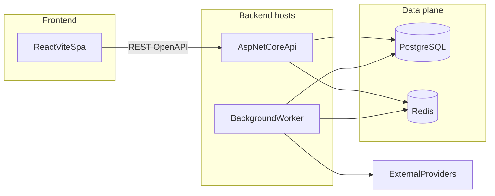
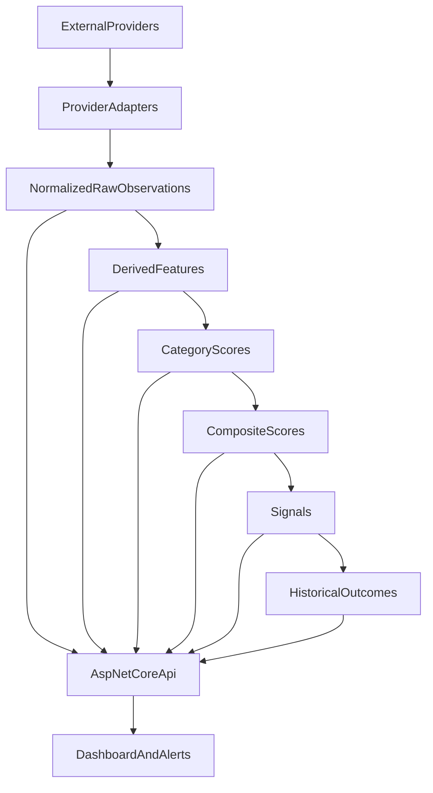

# Architecture

**Status:** Proposed, unless marked otherwise.

High-level system shape for the crypto intelligence platform. Product intent lives in [docs/product/product-spec.md](docs/product/product-spec.md). Domain concepts live in [docs/design/domain-model.md](docs/design/domain-model.md). Pipeline semantics live in [docs/design/data-pipeline.md](docs/design/data-pipeline.md). Scoring rules live in [docs/design/scoring-model.md](docs/design/scoring-model.md).

## Decision summary

| Decision | Status | Choice |
| --- | --- | --- |
| Application kind | Requirement | Analytics and research only; no trading or custody |
| Backend shape | Proposed | ASP.NET Core modular monolith: API host + worker host |
| Frontend shape | Proposed | React + TypeScript SPA on Vite |
| Frontend data/routing | Proposed | TanStack Router, TanStack Query, Zod, shadcn/ui |
| API contract | Proposed | REST + OpenAPI; generated frontend client/types |
| Persistence | Proposed | PostgreSQL authoritative; Redis disposable cache/coordination |
| Local runtime | Proposed | Docker Compose on Docker Desktop |
| Realtime transport | Future | Polling first; SSE/WebSockets only if latency needs justify it |
| Distribution | Requirement | No microservices, Kafka, or Kubernetes without a demonstrated need |

## Runtime topology

**Proposed** local Compose services: `frontend`, `api`, `worker`, `postgres`, `redis`. The API and worker may share one image with different entrypoints. Development Compose overrides enable bind mounts and hot reload; production images are multi-stage and run as non-root.

Prefer a same-origin production deployment with `/api` routed to ASP.NET Core and static SPA assets served by a web host/CDN. In local development, use Vite's development proxy for `/api` where practical; if origins differ, configure a narrow development-only CORS policy rather than a permissive production policy.

## Ingestion-to-dashboard flow

Workers own ingestion, feature calculation, scoring, signal detection, and later outcome measurement. The API reads persisted results and does not recalculate scores on each request. See [docs/design/data-pipeline.md](docs/design/data-pipeline.md).

## Modules and dependency direction

**Proposed** bounded modules inside one backend solution:

| Module | Responsibility |
| --- | --- |
| Catalog / universe | Canonical assets, provider symbol maps, Stage A eligibility |
| Ingestion | Provider adapters, scheduling, retry, raw payload isolation |
| Observations | Normalized market, derivatives, on-chain, and related snapshots |
| Features | Deterministic derived feature calculation |
| Scoring | Versioned category and composite scores |
| Signals and outcomes | Signal records and forward-return / MFE / MAE measurement |
| Intelligence events | Catalysts, unlocks, and other dated events |
| Watchlists and alerts | User-facing subscriptions over persisted scores and events |

Dependency rule: adapters and infrastructure depend inward on application and domain contracts. Domain modules must not depend on provider SDKs, HTTP clients, Redis, or UI types. Frontend depends on the API contract only.

The frontend is a client of the API, not a second domain layer. It may reshape view models for charts and tables; it must not invent scores or canonical identities.

## API boundary

**Proposed:**

- Versioned REST API documented with OpenAPI from the ASP.NET Core host.
- Frontend types and HTTP client generated from that contract. Do not hand-write a parallel DTO layer that can drift.
- Untrusted runtime inputs are validated: environment values, router search params, persisted UI state, and API responses where malformed data would affect correctness. Prefer validators generated from the OpenAPI contract when supported; do not manually duplicate every generated DTO as a Zod schema.
- Errors use RFC 9457 problem details.
- First product endpoint family is read-oriented rankings and asset detail. Writes are limited to watchlists/alerts when those features exist.
- Correlation IDs flow from incoming requests through logs and worker-triggered work where a request caused it.

The API is not a pass-through to provider APIs. Callers receive normalized, scored, persisted intelligence.

## Persistence and cache

| Store | Role |
| --- | --- |
| PostgreSQL | Source of truth for assets, observations, features, scores, signals, outcomes, events, and audit/lineage |
| Redis | Cache of hot rankings/detail reads, distributed locks, and short-lived job coordination |

Cache invalidation is a performance concern, not a correctness concern. A cold Redis must not change scores. One backend migration system owns application schemas; do not mix EF migrations, Supabase migrations, and ad-hoc SQL as competing authorities. Do not expose scoring writes through a generic REST data API.

**Unresolved:** hosted PostgreSQL (including Supabase as a managed Postgres option) versus Compose-only Postgres in production. If a hosted Postgres is chosen, Redis and workers still belong to this application. See unresolved decisions below.

## Background processing

**Proposed:** a dedicated worker host in the same modular monolith, sharing domain modules with the API.

- Scheduled jobs for cadence classes defined in [docs/design/data-pipeline.md](docs/design/data-pipeline.md).
- Idempotent handlers keyed by asset, observation time, and job type.
- Cancellation tokens on all I/O.
- Failures retry with backoff; poison messages/jobs are recorded, not silently dropped.
- Scoring is a job over persisted features, not an inline request handler.

The MVP runs the worker as a separate process/Compose service from the API while retaining one codebase and one deployable architecture. **Unresolved:** horizontal worker scaling and production placement. Change that topology only if measured operations require it.

## Realtime strategy

**Proposed for MVP:** the dashboard polls rankings and detail via TanStack Query.

**Future:** SSE or WebSockets if score freshness or alert latency cannot be met with polling. Do not add a message bus to push browser updates.

## Observability and operations

**Proposed** defaults, not a vendor selection:

- Structured logs, traces, and metrics with a correlation identifier.
- Health checks for API, worker liveness, PostgreSQL, and Redis.
- Secrets via environment or a secret store; committed samples contain no credentials.
- Deterministic builds and pinned tool versions.

## Frontend integration

**Proposed:**

- React + TypeScript + Vite SPA.
- TanStack Router for typed routes and search params (rankings filters, asset id, time range).
- TanStack Query for server state, caching, and polling.
- shadcn/ui for interface primitives.
- A financial charting library for candlesticks and time series (**Unresolved** which library).
- Strict TypeScript.

Follow current official documentation listed in [AGENTS.md](AGENTS.md). Prefer each library’s recommended patterns over ad-hoc alternatives.

## Major tradeoffs

| Choice | Why | Cost |
| --- | --- | --- |
| Modular monolith | Matches one product and one team; keeps scoring, data, and API consistent | Requires module discipline so it does not become a ball of mud |
| SPA + generated OpenAPI client | Dashboard is data-heavy and authenticated-app-like; avoids Next.js SSR/API-route overlap with ASP.NET Core | No first-class public SEO pages until a later rendering strategy exists |
| Workers persist scores; API reads them | Scoring stays reproducible and off the request path | Rankings are as fresh as the last successful job |
| Postgres + Redis | Clear source of truth vs disposable speed | Two local data services; cache bugs must not corrupt history |
| Polling first | Simplest correct integration with TanStack Query | Higher perceived latency than push |
| Heuristic scores before calibration | Allows an end-to-end slice without fake statistical claims | UI must not present scores as probabilities |

## Unresolved decisions

Record resolutions in an exec plan or a later revision of this document. Do not silently pick them in code comments.

- External market-data vendors and licensing. See [docs/engineering/data-sources.md](docs/engineering/data-sources.md).
- Financial charting library.
- Production Postgres hosting (self-managed, cloud Postgres, or Supabase-as-Postgres).
- Exact ingestion cadences and retention windows.
- Authentication/authorization model and alert channels.
- Whether later latency needs justify SSE/WebSockets or separately deployed workers.
- .NET and Node LTS versions current at implementation time.
