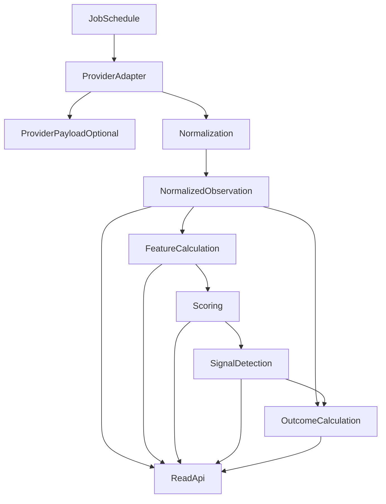

# Data pipeline

**Status:** Proposed, with requirements called out.

How observations become persisted intelligence. Domain types: [domain-model.md](domain-model.md). Scoring: [scoring-model.md](scoring-model.md). Provider capabilities: [../engineering/data-sources.md](../engineering/data-sources.md).

## Pipeline stages

Workers run this pipeline. The API reads outputs. See [ARCHITECTURE.md](../../ARCHITECTURE.md).

## Provider adapters

Each provider has an adapter that:

- Authenticates and paginates using that provider’s official API documentation (validated at integration time).
- Maps provider DTOs to canonical observations.
- Records provider identity, native instrument id, and request/response metadata needed for replay.
- Surfaces rate-limit, authorization, and schema failures as structured errors.

Adapters must not compute category or composite scores. They may perform only mechanical unit conversion required to reach canonical observations (for example, documented scale factors).

**Requirement:** provider-specific types stay in the adapter project/module.

## Ingestion and scheduling

Jobs are scheduled by **cadence class**, not by invented vendor-specific frequencies.

| Cadence class | Typical use | Interval is |
| --- | --- | --- |
| Fast market | Trades/candles, funding, liquidations snapshots | **Unresolved** (minutes or faster) |
| Slow market | OI aggregates, order-book snapshots | **Unresolved** |
| Daily research | Tokenomics, unlocks, fundamentals, many on-chain aggregates | **Unresolved** |
| Event-driven | News/catalysts, unlock occurrences | As events arrive, with polling fallback |

Do not hard-code a provider’s undocumented rate as architecture. Choose intervals after vendor validation and record them in an exec plan.

Stage A universe scans use cheaper cadence and cheaper endpoints than Stage B deep analysis. Architecture must not require every feature for every asset on the fast cadence.

Each scoring run has an explicit as-of time and input readiness policy. Use provider watermarks or closed-period rules so a score does not mix a completed candle with an incomplete interval by accident. Late observations may trigger a new calculation record or an explicit replay; they must not mutate a published score invisibly.

## Raw versus normalized data

| Layer | Allowed contents | Forbidden contents |
| --- | --- | --- |
| Provider payload | Vendor JSON/CSV as received, plus fetch metadata | Domain feature names, scores |
| Normalized observation | Canonical asset, unit, UTC times, typed values | Vendor field names as the domain API |
| Feature | Derived values from observations | LLM text, UI formatting |

Retain raw payloads when they are needed for audit, replay, or schema-drift tests. Retention windows are **Unresolved**.

## Normalization rules

- Map to canonical asset via `ProviderInstrumentRef`.
- Convert to canonical units documented by the feature/observation kind (price in quote currency, rates as fractions or percent but never both silently, OI in coins or USD with unit recorded).
- Drop or quarantine rows that fail mapping; do not guess the asset.
- Preserve vendor precision; do not round through binary floats for values that will be scored.
- Record quote currency, contract multiplier, and rate representation where relevant; numeric magnitude alone is not a unit.

## Feature calculation

Deterministic functions from observations → feature values, invoked by jobs for Stage B assets (and for the small MVP universe).

- Same inputs + same code version ⇒ same outputs.
- Missing inputs produce missing or inapplicable features per [scoring-model.md](scoring-model.md), not silent zeros.
- Feature jobs are incremental where possible but must support full replay for a time range.

## Scoring and signal detection

Scoring reads features (and model manifest), writes category scores, composite scores, and confidence scores with `ScoringModelVersion`.

Signal detection reads those scores (and optional event rules) and writes `Signal` records. Detection does not reach back into provider DTOs.

## Historical outcome calculation

A later job, once the horizon has elapsed, attaches returns and MFE/MAE to signals or scored snapshots.

- Use the same price series definition for all horizons (document the series: for example, canonical spot close).
- Do not peek at future data when reproducing a score; outcomes are separate writes.
- Gaps in candles must be handled explicitly (skip, mark incomplete, or forward-fill only if a documented rule says so). Silent interpolation is forbidden.
- Define MFE/MAE relative to the signal direction and as-of reference price, or explicitly store unsigned path extrema. Do not leave the convention implicit.

## Failure, retry, idempotency

**Requirement:**

- A job key includes job type, canonical asset (or universe snapshot id), provider when relevant, and the logical period/as-of time.
- Re-running a successful job does not duplicate observations, features, scores, or signals.
- Transient provider/network failures retry with backoff and respect documented rate limits.
- Permanent mapping failures (unknown symbol, unsupported unit) go to a dead-letter/quarantine path visible in operations, not an infinite retry.
- Partial provider coverage must not abort unrelated assets in the same run without a recorded batch error.

## Timestamp and precision rules

**Requirement:**

| Clock | Meaning |
| --- | --- |
| Event time | When the market/event actually occurred, UTC |
| As-of time | The logical time the feature/score claims to describe, UTC |
| Ingested-at | When this system stored the payload, UTC |

- Store timestamps in UTC. Do not persist local exchange time zones without conversion.
- Candle bars need an explicit convention (open time vs close time) applied consistently.
- Decimal values use a precision-safe numeric type in persistence and scoring. Do not use IEEE-754 as the source of truth for prices, sizes, or USD notionals.
- Percent versus fraction must be explicit on every rate-like field.
- API wire representations must preserve the precision required by the consumer. Use decimal strings or scaled integers where exact round trips matter; chart-only numeric projections may use floating point after explicit conversion.

## Replay and reprocessing

Reprocessing a historical range with the same feature-calculation versions, input snapshots, and scoring-model version must reproduce stored scores exactly under the documented numeric rules.

Reprocessing with a new model version writes **new** score rows (or a new series) tagged with the new version. It does not overwrite the old version’s history.

A bug fix that changes a feature or score result creates a new calculation/model version. Never change same-version behavior and call the difference a replay.

## Unresolved

- Exact cadence intervals and retention.
- Whether all raw payloads are stored or only hashed/sampled.
- Price series used for outcome returns (which venue, which index).
- Batch size and parallelism once a vendor is chosen.
