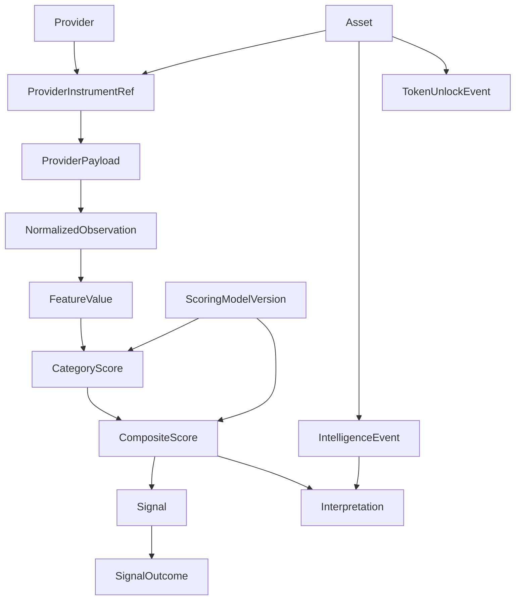

# Domain model

**Status:** Proposed conceptual model. Not a database schema. Do not design every column here.

This document defines the language the rest of the system must use. Persistence details belong in later implementation work. Pipeline movement of these concepts is in [data-pipeline.md](data-pipeline.md). Scoring semantics are in [scoring-model.md](scoring-model.md).

M3 implements the bounded observation-to-score subset. A batch fixes universe,
T, K, creation time and reconstruction status. Feature sets retain every
definition's state/applicability, units, window evidence and observation/conflict
keys. Each score binds its asset/as-of/model to the exact feature snapshot;
category scores and context coverage stay distinct. See the [M3 contract](../../backend/src/Analysis.Domain/Scoring/Manifests/README.md)
and EF migration for persistence. Outcomes, events and interpretations below
remain conceptual future entities.

## Principles

- Canonical domain types are independent of any one vendor payload.
- Provider identity is first-class so the same asset can be observed through many sources.
- Measurements, derived features, scores, and text interpretations are different objects.
- History is append-friendly: a score at time T remains the score that was produced at T, even if the model later changes.

## Concept map

## Asset

A tradable or researchable crypto instrument in the canonical catalog (for example Bitcoin, Ether, Solana).

An asset has a stable internal identity, display name, and asset class/sector tags as needed. It is not “BTCUSDT on Binance”. Those are provider instrument references.

**Requirement:** Stage A eligibility is a property of an asset in a universe snapshot, not a hard-delete of the asset.

## Provider and source identity

A **Provider** is an external system (exchange, market-data vendor, on-chain indexer, fundamentals vendor, news source).

A **ProviderInstrumentRef** maps a provider’s native symbol, product, or contract to a canonical asset (and optionally to a specific market: spot, perpetual, dated future, option).

**Requirement:** symbol strings are ambiguous. BTC, BTCUSDT, XBT, and a perpetual swap are not interchangeable without this map.

## Provider payload

The untouched or minimally wrapped response from a provider, stored when needed for audit, replay, or schema-drift detection.

Payloads are adapter-local. They must not leak into feature or scoring code.

## Normalized observation / snapshot

A point-in-time measurement in canonical units after adapter mapping.

Examples: OHLCV bar, funding rate, open interest, spot CVD, exchange netflow, TVL, reported circulating supply.

An observation records at least:

- Canonical asset (and market/instrument context when relevant)
- Provider
- Observation kind
- Event time and ingested-at time (see [data-pipeline.md](data-pipeline.md))
- Value(s) with unit
- Completeness/freshness flags when known

Raw observations are facts as of a time. They are not scores.

## Feature value

A derived quantity computed from observations by deterministic code: returns, relative strength versus BTC, OI change over a window, basis, reserve change, and similar.

A feature has a stable name/id, an as-of time, inputs (which observations/windows), a unit, and a calculation version if the formula can change independently of the scoring-model version.

Features may be inapplicable (options metrics on an asset with no liquid options). Inapplicable is not the same as zero.

## Category score

A bounded, directional summary of one signal family (market regime, derivatives, tokenomics, and so on) from a set of features.

Category scores are model-versioned. See [scoring-model.md](scoring-model.md).

## Composite score

A bounded, directional summary of category scores, plus bullish and bearish confidence scores as defined by the scoring model.

**Requirement:** a composite score is a heuristic ranking input until calibration exists. It is not a probability.

Each persisted composite score identifies the immutable model version and the exact category/feature input snapshot used to calculate it. Referencing only “latest features” is insufficient historical lineage.

## Signal

A recorded analytical conclusion at an as-of time: for example a ranking snapshot row, a threshold cross, a divergence flag, or a regime label.

A signal points at the composite/category scores and model version that produced it. Do not create signals that cannot be traced to structured scores or explicit event rules.

## Intelligence event (catalysts and risks)

A dated qualitative or discrete event: upgrade, listing, governance proposal, partnership, institutional development, regulatory/legal item, security incident.

Events may be extracted from news or vendor calendars. They influence explanations and, when a model says so, features or category inputs. They do not secretly overwrite the numeric calculator.

## Interpretation

Human- or machine-written natural language that explains structured score differences, feature changes, or intelligence events.

An interpretation references the structured evidence it describes. It is never a raw observation, feature, category score, or authoritative numeric input. LLM-extracted catalyst candidates must pass the same provenance and validation rules as other intelligence events before deterministic scoring code may consume a structured event feature.

## Token unlock event

A scheduled or observed supply event: unlock, emission cliff, or related treasury movement window.

Unlocks are first-class because they are both a tokenomics feature input and a catalyst-like dated event.

## Scoring model version

An immutable identifier for the code + configuration that turned features into category and composite scores: feature set, normalization, weights, missing-data policy, and applicable-universe rules.

**Requirement:** historical scores retain this version (and enough config hash/manifest to reproduce). Changing weights requires a new version; it must not rewrite old scores in place.

## Signal outcome

Forward-looking measurement attached to a signal or scored snapshot after enough time has elapsed:

- Simple returns at 1h, 4h, 1d, 3d, 7d, 14d, 30d
- Maximum favorable excursion
- Maximum adverse excursion

Outcomes are observations about the market path after the signal, not part of the score that was issued.

## What this model deliberately omits

- Table names, indexes, and column types
- User/auth entities until authentication is chosen
- Order, fill, position, and wallet aggregates (non-goals)
- LLM prompt objects as domain sources of numeric truth
